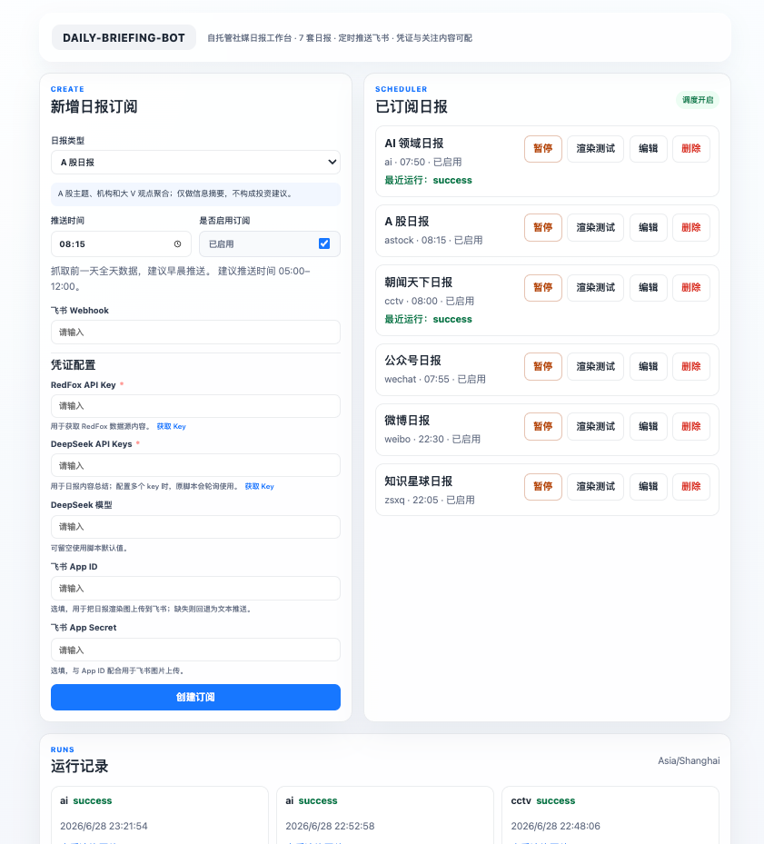
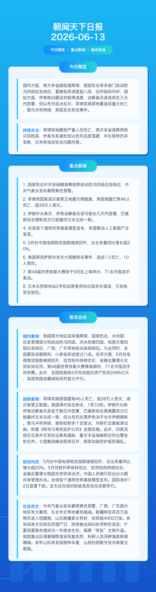

# Daily Briefing Bot

Daily Briefing Bot is a configurable AI-powered briefing system. It collects
signals from social media, creator communities, news programs, official feeds,
and third-party data APIs, summarizes them with an LLM, renders mobile-friendly
daily report images, and pushes the result to Feishu or WeCom robots.

This repository started as a personal automation project and is being cleaned up
into a reusable open-source tool. It can be used as a CLI-first local automation
project or as a self-hosted subscription dashboard with an in-process scheduler.



## Features

- Multi-source daily reports:
  - Weibo hot topics and followed bloggers
  - Knowledge Planet group summaries
  - CCTV `朝闻天下`
  - WeChat official account hot articles and followed accounts
  - Douyin daily hot works
  - AI industry feed from public account and Xiaohongshu sources
  - A-share market themes and institution/KOL viewpoints
- LLM summaries with cache, timeout handling, fallback summaries, and multi-key
  concurrency support.
- Image report rendering for Feishu image messages, with text-card fallback.
- Feishu and WeCom robot delivery.
- macOS `launchd` examples for scheduled local automation.
- Docker Compose subscription dashboard for self-hosted scheduling.
- Render-only mode for local visual QA before sending messages.

## Project Layout

```text
work/
  ai_daily/         AI industry briefing
  astock_daily/     A-share market briefing
  cctv_daily/       CCTV 朝闻天下 briefing
  douyin_daily/     Douyin hot works briefing
  wechat_daily/     WeChat official account briefing
  weibo_daily/      Weibo briefing and hot-topic collector
  zsxq_daily/       Knowledge Planet briefing
  daily_image.py    Shared image report renderer
docs/
  architecture.md
  configuration.md
  development.md
  deployment-launchd.md
  report-matrix.md
  running-reports.md
  subscription-dashboard.md
  security.md
apps/
  api/              FastAPI subscription dashboard API
  web/              Next.js subscription dashboard UI
examples/
  env/
deploy/
  launchd/         Generic macOS launchd templates
```

## Quick Start

1. Clone the repository.
2. Install Python dependencies.
3. Copy an example env file for the report you want to run.
4. Fill in only the credentials required by that report.
5. Run in render-only mode first.

```bash
python3 -m pip install --upgrade pip
python3 -m pip install -r requirements.txt
```

For local development, editable install is also supported:

```bash
python3 -m pip install -e .
daily-briefing list
```

Example:

```bash
cp examples/env/wechat_daily.env.example work/wechat_daily/.env
daily-briefing run wechat \
  --env work/wechat_daily/.env \
  --render-only \
  --output /tmp/wechat_daily.png
```

When the image looks correct, configure push targets and run without
`RENDER_ONLY=1`.

## Subscription Dashboard

The dashboard is the easiest way to run Daily Briefing Bot as a long-running
self-hosted service. It lets you create report subscriptions, configure
credentials and followed sources, set push times, run render-only tests, and
send reports to the Feishu webhook attached to each subscription.

```bash
cp .env.dashboard.example .env
docker compose -f docker-compose.dashboard.yml up --build -d
```

Default URLs:

- Web: <http://localhost:3010>
- API: <http://localhost:8010>

For Tailscale access, keep `NEXT_PUBLIC_API_BASE_URL` empty and open the web
port on your Tailscale IP, for example `http://100.x.y.z:3010`.

See [Subscription Dashboard](docs/subscription-dashboard.md) for deployment,
secret storage, and migration details.

Example rendered report:



## Configuration

Configuration is environment-variable based. Real `.env` files, cookies, caches,
logs, and generated images are intentionally ignored by git.

Start with:

- [Configuration Guide](docs/configuration.md)
- [Running Reports](docs/running-reports.md)
- [Subscription Dashboard](docs/subscription-dashboard.md)
- [Report Matrix](docs/report-matrix.md)
- [Development Guide](docs/development.md)
- [macOS launchd Deployment](docs/deployment-launchd.md)
- [Security Guide](docs/security.md)

## Push Channels

- Feishu custom bot webhook for text-card delivery.
- Feishu app credentials for image upload and image-card delivery.
- WeCom group robot webhook for markdown delivery.

If image delivery fails or is not configured, the scripts fall back to text-card
delivery where supported.

## Data Sources

Some reports depend on authenticated cookies or third-party paid APIs. The
project does not include credentials. You are responsible for complying with the
terms of service of every data source you configure.

## Local Checks

Run the same smoke checks used by CI:

```bash
make check
make dashboard-check
```

## Development Status

The current implementation is functional and ready for a `0.1.0` open-source
preview. It includes shared CLI/runtime helpers, push helpers, LLM primitives,
RedFox request/cache helpers, smoke tests, and macOS launchd examples.

The next milestones focus on portable deployment options, clearer provider
interfaces, and more shared report data models. See [ROADMAP.md](ROADMAP.md).

## License

MIT. See [LICENSE](LICENSE).
